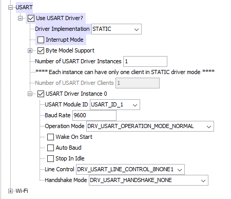

# Experiment 3: Universal Asynchronous Receiver Transmitter (UART)

## Overview

This experiment explores **asynchronous serial communication** using the **Universal Asynchronous Receiver Transmitter (UART)** module in the **PIC32MX** microcontroller. The experiment focuses on establishing a **point-to-point serial link** between the **ChipKIT™ MX7** and a **PC** using a terminal emulation program.

## Objectives

- Understand **asynchronous communication** and its role in microcontroller-based systems.
- Learn how to configure and initialize the **UART module** in PIC32MX.
- Implement **data transmission and reception** using a serial interface.
- Develop a simple **echo program** to process incoming data.
- Control LEDs using received serial commands.

## Equipment Required

- **ChipKIT™ Pro MX7** processor board
- **USB cable**
- **Microchip MPLAB® X IDE**
- **MPLAB® XC32++ Compiler**
- **PC-based terminal emulator** (e.g., HyperTerminal)

## Experiment Steps

### Part 1: Receive and Echo Byte Data
1. Configure the **USART driver** in MPLAB Harmony.
2. Send a character from the PC terminal to the PIC32.
3. The PIC32 increments the received character's **ASCII value** and sends it back.

### Part 2: Receive and Echo a String
1. Send a **string command** from the PC terminal.
2. The PIC32 echoes the received string.
3. Specific commands (e.g., `LED1`) turn on corresponding **LEDs**.
4. If an unrecognized command is received, all LEDs are turned **off**.

## Key Ideas

- **UART Basics**: Start/Stop bits, Baud rate, Data bits, Parity, Flow control.
- **UART Communication**: Full-duplex asynchronous serial data transmission.
- **USART Configuration**: Setting baud rate, parity, and data format in MPLAB Harmony.
- **Polling vs. Interrupts**: This experiment uses **polling-based communication**.
- **Embedded Programming**: Managing **transmit/receive buffers** and processing data.
- **Peripheral Control**: Using UART commands to control **LEDs** on the ChipKIT™ MX7.

## Usage

To test the experiment:
1. Configure **USART** in **MPLAB Harmony**.
2. Open a **serial terminal** (Baud rate: **57.6k**, Data: **8-bit**, Parity: **None**, Stop bits: **1**).
3. Send characters or commands and observe the **echo response** or LED control.

---

This experiment helps build a fundamental understanding of **UART-based communication** in embedded systems, which is crucial for interfacing microcontrollers with external devices.

## Working Notes (UART Configuration):

